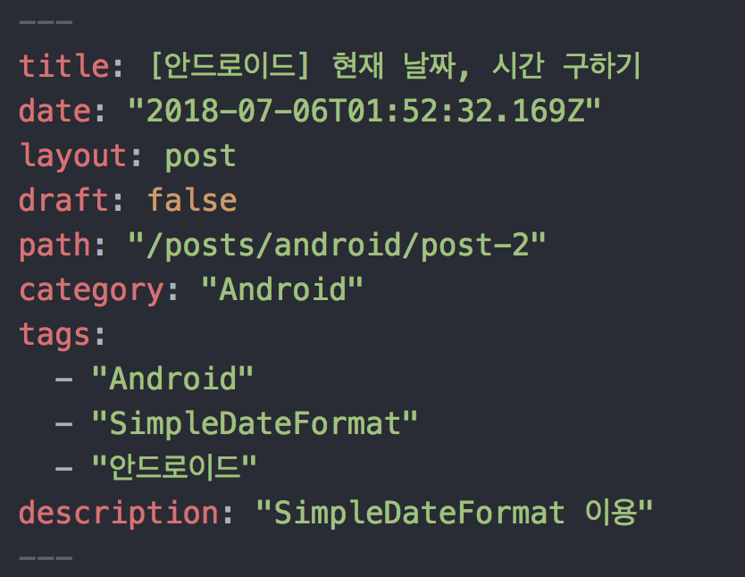
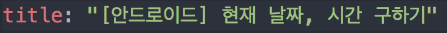

현재 Gatsby를 이용하여 블로그를 작성하고 있고, Netlify로 배포를 진행하고 있다.  
블로그를 시작한지 얼마 안 돼서 설레는 마음으로 포스팅을 하는 도중에 이상한 에러가 발목을 잡았다.


<에러 화면>

```
YAMLException: can not read a block mapping entry; a multiline key m  ay not be an implicit key at line 3, column 5:
```


<이 부분이 잘못 되었다는데...>


화살표가 date: 에 가 있길래 무엇이 잘못 되었나 헛짓거리 하다가 구글링으로 해결했다.

제목에 **대괄호** 가 있으면 안되고, 이를 쓰려면 제목에 ""를 붙혀주면 해결이 된다.




출처 : https://simhyejin.github.io/2016/06/24/markdown-post-title/
