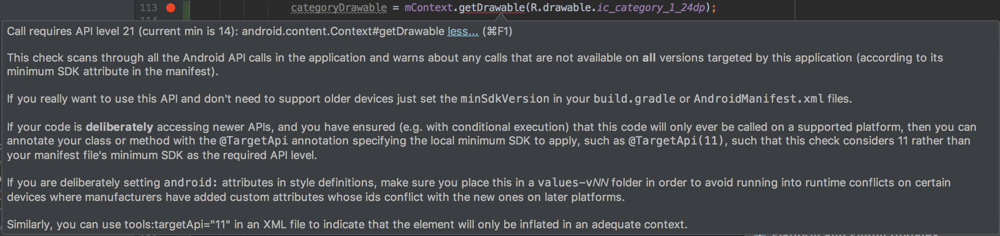

*Call requires API level 21 (current min is 14): android.content.Context#getDrawable less... (⌘F1)
This check scans through all the Android API calls in the application and warns about any calls that are not available on all versions targeted by this application (according to its minimum SDK attribute in the manifest).  If you really want to use this API and don't need to support older devices just set the minSdkVersion in your build.gradle or AndroidManifest.xml files. ... 후략*


### 다음과 같은 에러를 본 적이 있는가?

분명 Context도 맞게 쓰고 모두 옳게 작성했지만 또 또 찡찡댄다..  
에러를 해석해보면 API Level 21 이상의 Device에서만 이 함수가 동작한단다.  
(21이면 롤리팝 버전이다...;)  

고것도 안되는 똥폰 갖다 버리라고 하고 싶지만 우리는 모두를 위한 개발자이므로(?)  
이를 해결해보자.

### 다행히도 쉽게 해결하는 방법이 있다.


```JAVA
Drawable mDrawable = mContext.getDrawable(R.drawable.ic_add_black_24dp);
```

(mContext는 `Context`를 변수로 받아온 것이다.)  
위와 같이 썼을 때 문제가 되는 것이었는데, 이를 아래와 같이 고쳐보자

```JAVA
Drawable mDrawable = ContextCompat.getDrawable(mContext, R.drawable.ic_add_black_24dp);
```

`ContextCompat`이라는 친구를 사용하게되면 빨간줄이 없어지고 편안해진다.
