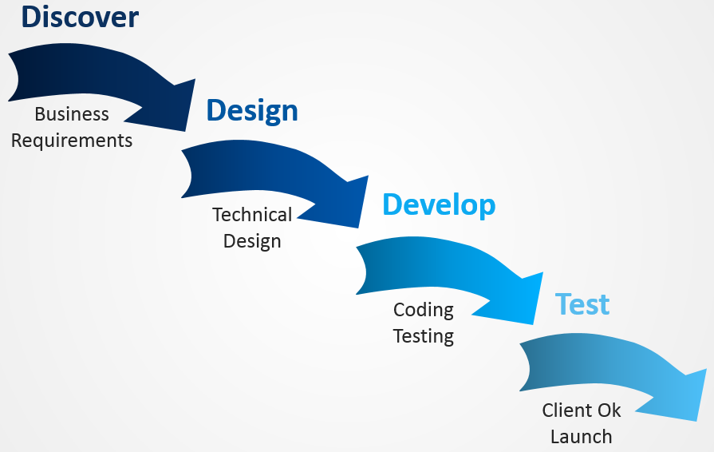
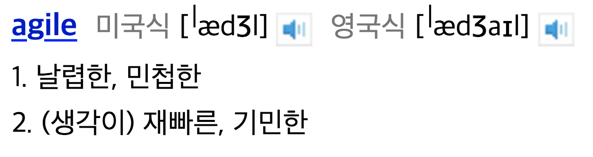
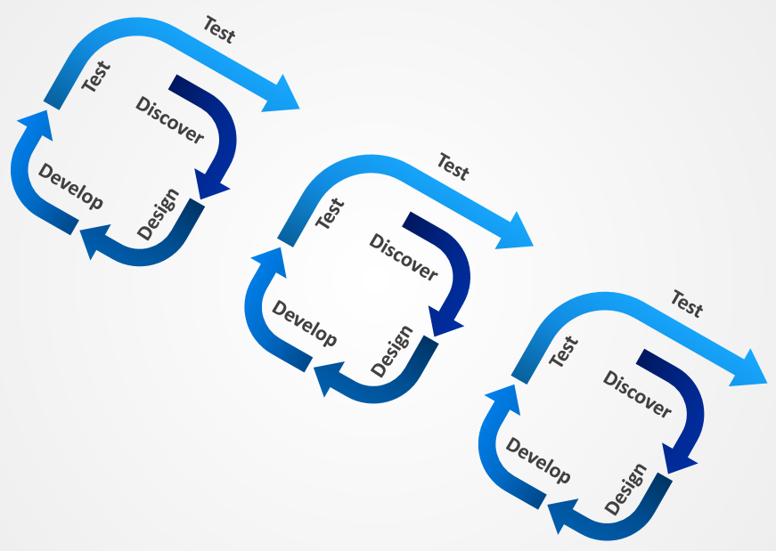

최근 스타트업을 준비하면서, 다른 스타트업의 사업계획서를 많이 조사하게 되었는데,  
요즘 핫(?)한 린 스타트업에 관심이 가서 조사해보다 익숙한 단어를 보게 되었다.
## · 폭포수(Waterfall)모델과 애자일(Agile)모델  
대학 수업을 열심히 들은 편은 아니지만 이름이 특이해서 어렴풋이 기억이 나는 폭포수모델...
소프트웨어 공학 수업에서 시험기간에 달달 외웠던 기억이 난다.  
~~암기과목으로 만든 망할 교수덕에..~~  
그래도 덕분에(?) '어 나 배운거다'하고 한 번 더 짚고 넘어갈 수 있는 기회가 되었다.
이 둘은 프로젝트 진행 방식인데, 둘은 상반되는 개념이라고 봐도 될 듯 하다.

## · 순차적인흐름이 마치 폭포수같다(?) 폭포수(Waterfall)모델
중력을 거스르지 않고 그대로 순차적으로 떨어지는 폭포수처럼 진행된다고 해서 붙혀진 이름이라고 한다. 이름이 꽤 재밌다.  
`폭포수모델 (Waterfall Model)`은 요구분석 → 설계 → 디자인 → 코딩 → 개발순으로
순차적으로 이루어지는 프로젝트 진행 방식이다.  
어떻게 보면 당연하고, 우리에게 익숙하고, 가장 간단한 프로젝트 모델이다.  

  
워터폴 모델은 오랜 기간 사용된 기법이니만큼 적용 사례가 많고, 단계별로 정형화된 접근방식을 사용하는 이유로 기술적인 위험 요소가 적다는 장점을 가지고 있다고 한다.
정해진 순서대로 각 파트의 업무가 분장되고 관리된다는 점도 장점이 될 수 있겠다.  
하지만 팀 프로젝트를 해본 사람은 알겠지만, 각각의 단계를 딱 딱 명확히 구분하고, 단계가 끝난 뒤에야 다음 단계를 진행하는 것은, 정말 쉽지 않은 일이다. ~~절대 안된다. 경험담이다.~~  

이를 스타트업에 비추어 봤을 때, 폭포수가 맨 밑으로 떨어지기 전까지, 즉 프로젝트가 모두 개발되어 고객에게 모습을 비추어 내기 전까지는 고객들은 상품의 실체를 확인하기 어렵다.  
이러한 단점들을 보완한 여러가지 프로젝트 수행 방법이 있는데, 그 중 하나가 `애자일 모델 (Agile Model)`이다.

## · 재빠르다, 민첩하다, 애자일 (Agile) 모델  

...이런 뜻이다.  
애자일 모델이 다른 방법론과 구별되는 가장 큰 차이점은 문서를 통한 개발이 아니라 실질적인 코딩을 통한 방법론이라는 점이다.
  

한치 앞을 예측할 수 없는 각박한 요즘 세상에 걸맞는 프로젝트 모델이다.  
전체적인 플랜을 짜고 차근 차근 ~~차범근~~ 폭포수가 중력에 몸을 맡기듯 단계별로 정형화된 접근방식과는 상반되게  
**일정한 주기를 가지고 끊임없이 프로토 타입을 만들어 내며 필요할 때마다 요구사항을 더하고 수정하여 커다란 소프트웨어를 개발해 나가는 방식이 `애자일 모델 (Agile Model)`이다.**  
그림에서도 볼 수 있듯이 `폭포수모델`의 전체적 과정이 계속적으로 반복되는 것을 확인할 수 있다.  
맘에 들 떄 까지(?) 계속 수정하는 모델이라고 생각하면 될 것 같다.
