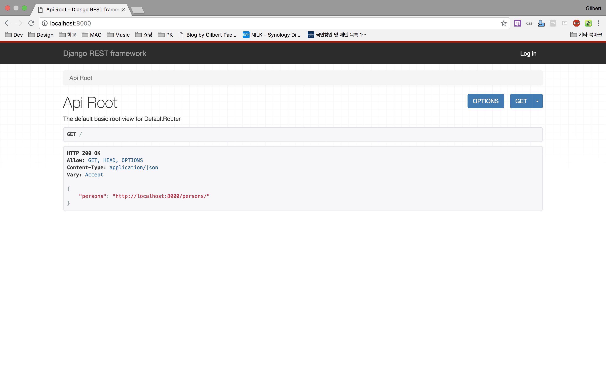

Django에는 REST API를 만들 수 있는 *Django REST framework* 가 존재한다.  
[Django REST framework Quickstart](http://www.django-rest-framework.org/tutorial/quickstart/)에서는 Django tutorial과 다른 디렉토리 구조를 사용하고 django에 기본적으로 내장 되어있는 User, Group 에 대한 예제를 다룬다.  
이 포스트에서는 Django tutorial에서 사용하는 디렉토리 구조를 사용하고 새로운 앱과 모델을 생성하여 REST API를 생성하는 방법에 대해 작성하였다.  

## 프로젝트 설정
프로젝트를 실행할 Root 디렉토리를 생성하자. 이름은 맘대로~  

```
$ mkdir django-rest-tutorial  
$ cd django-rest-tutorial
```

*django* 와 *djangorestframework* 를 pip로 설치한다.  
```
$ pip install django  
$ pip install djangorestframework
```

프로젝트와 앱을 생성한다.
프로젝트 이름은 *tutorial* , 앱이름은 *myapp* 이라고 하겠다.

```
$ django-admin.py startproject tutorial
$ cd tutorial
$ python manage.py startapp myapp
```  

## Settings

*Django REST Framework* 를 사용하기 위해서는  
*tutorial/settings.py* 에 아래와 같이 추가해주자.

```python
INSTALLED_APPS = {
    #...생략...
    'rest_framework',
    'myapp'
}

```

## Models
*first_name* 과 *last_name* 필드를 가진 *Person* 이라는 model을 정의해보았다.

*myapp/models.py*

```python
from django.db import Models

class Person(models.Model):
      first_name = models.CharField(max_length=30)
      last_name = models.CharField(max_length=30)
```

## Serializers
Serializer를 사용한다.
*myapp/serializers.py*

```python
from myapp.models import Person
from rest_framework import serializers

class PersonSerializer(serializers.HyperlinkedModelSerializer):
    class Meta:
        model = Person
        fields = ('first_name', 'last_name')

```
## Views
View들을 그룹화하여 간결하게 사용할 수 있다.
*myapp/views.py*

```python
from rest_framework import viewsets
from myapp.serializers import PersonSerializer
from myapp.models import Person


class PersonViewSet(viewsets.ModelViewSet):
    queryset = Person.objects.all()
    serializer_class = PersonSerializer

```
## URLs
views에서 작성한 viewset을 Router에 연결하면 url을 자동으로 편하게 연결해준다.

*tutorial/urls.py*

```python
from django.conf.urls import url, include
from rest_framework import routers
from myapp import views


router = routers.DefaultRouter()
router.register(r'persons', views.PersonViewSet)

urlpatterns = [
    url(r'^', include(router.urls)),
    url(r'^api-auth/', include('rest_framework.urls', namespace='rest_framework'))
]

```

## 드디어 실행...


```
python manage.py makemigrations
python manage.py migrate
python manage.py runserver
```

이 세 줄을 실행 후 *http://localhost:8080* 에 접속하면 확인할 수 있다.




출처 : https://cjh5414.github.io/django-rest-framework/
